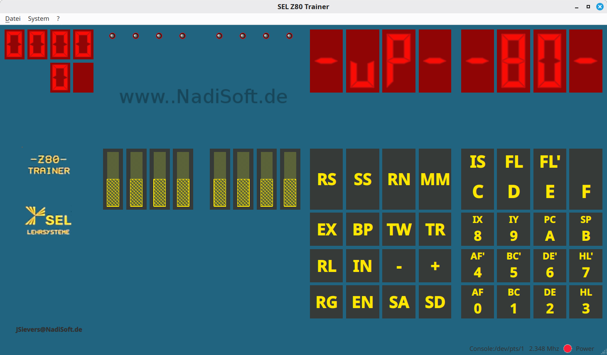

# SELZ80Trainer

[](https://github.com/notwendig/SELZ80Trainer/actions/workflows/ci.yml)
[](LICENSE)
[](CMakeLists.txt)
[](https://www.qt.io/)

A Qt 6 based emulator for the **SEL Z80 Trainer** educational computer.

SELZ80Trainer combines a Z80 CPU emulator, the trainer ROM, simulated front-panel
controls, LEDs and seven-segment displays in a desktop application. The ROM is assembled
from source as part of the CMake build.



## Features

- Zilog Z80 CPU emulation
- Graphical SEL trainer front panel
- Seven-segment displays, LEDs and switch controls
- SEL trainer keyboard
- Built-in trainer system views
- ROM assembly from `ROMS/*.z80`
- Automatic generation of `SELRom.inc` and `SELRom.h` from the zmac listing
- Qt resource integration for the generated `SELRom.bin`
- German Qt translation support
- CMake-based build with Git submodules

## Repository layout

```text
SELZ80Trainer/
├── ROMS/                   Z80 assembler sources and generated symbols
├── Resources/              Images, Qt resources and generated SELRom.bin
├── Z80/                    Z80 emulator submodule
├── qvintage/               QtVintage widget submodule
├── scripts/                Build/helper scripts
├── src/                    Application sources and Qt Designer forms
├── docs/                   Project documentation
├── .github/                GitHub Actions and contribution templates
├── CMakeLists.txt
└── CMakePresets.json
```

## Requirements

- CMake 3.21 or newer
- C++20 compiler
- Qt 6.2 or newer
  - Widgets
  - LinguistTools
- Python 3
- `zmac` Z80 macro assembler
- Git

The project uses the following Git submodules:

- `Z80` — `notwendig/z80`
- `qvintage` — `notwendig/QtVintage`

## Clone

Clone recursively so the required submodules are available:

```bash
git clone --recursive git@github.com:notwendig/SELZ80Trainer.git
cd SELZ80Trainer
```

If the repository was cloned without submodules:

```bash
git submodule update --init --recursive
```

## Install zmac

SELZ80Trainer searches for `zmac` in `PATH` and in `~/bin`.

A simple source installation is:

```bash
git clone https://github.com/gp48k/zmac.git /tmp/zmac
make -C /tmp/zmac/src
mkdir -p ~/bin
cp /tmp/zmac/src/zmac ~/bin/zmac
```

Verify it:

```bash
~/bin/zmac --version || ~/bin/zmac --help
```

## Build

### With CMake presets

Debug:

```bash
cmake --preset debug
cmake --build --preset debug
```

Release:

```bash
cmake --preset release
cmake --build --preset release
```

### Without presets

```bash
cmake \
    -S . \
    -B build/Desktop_Debug \
    -DCMAKE_BUILD_TYPE=Debug

cmake --build build/Desktop_Debug -j"$(nproc)"
```

## ROM build pipeline

`ROMS/SELRom.z80` is the authoritative ROM source.

During the build:

```text
ROMS/SELRom.z80
        |
        +-- zmac --> build/.../roms/SELRom.cim
        |           build/.../roms/SELRom.lst
        |
        +-- copy --> build/.../roms/SELRom.bin
        |           Resources/SELRom.bin
        |
        +-- parser -> ROMS/SELRom.inc
                    ROMS/SELRom.h
```

Do not edit generated ROM files or generated symbol files unless you intentionally
want to replace generated output. Change `SELRom.z80` or
`scripts/generate_selrom_symbols.py` and rebuild instead.

## Install

Install into a local prefix:

```bash
cmake --install build/release --prefix "$HOME/.local"
```

or, for a manually configured build:

```bash
cmake --install build/Desktop_Debug --prefix "$HOME/.local"
```

## Documentation

- [Building](docs/BUILDING.md)
- [Architecture](docs/ARCHITECTURE.md)
- [Contributing](CONTRIBUTING.md)
- [Security policy](SECURITY.md)
- [Changelog](CHANGELOG.md)

The original trainer documentation is available in `manual.pdf`.

## Contributing

Bug reports, improvements and pull requests are welcome. Please read
[CONTRIBUTING.md](CONTRIBUTING.md) before submitting a change.

## License

SELZ80Trainer is licensed under the
[GNU General Public License v3.0 only](LICENSE).

The `Z80` and `qvintage` directories are Git submodules and remain subject to the
license terms of their respective upstream repositories. Images, manuals, logos and
other historical material may have separate rights or trademark restrictions; their
presence in the repository does not imply transfer of trademark rights.
